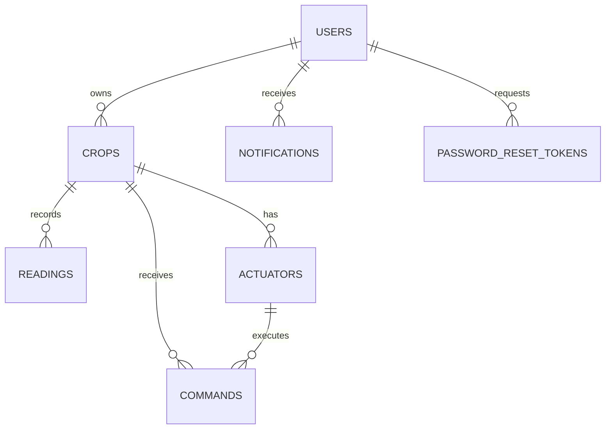

# SmartPot-DB (MongoDB)

## Estado del Proyecto

[](https://github.com/SmartPotTech/SmartPot-DB/actions/workflows/ci.yml)
[](https://github.com/SmartPotTech/SmartPot-DB/actions/workflows/packaging.yml)

## Descripción

SmartPot-DB es la base de datos de **SmartPot**: una imagen de **MongoDB 8.0** que en su primer arranque crea el usuario de la aplicación, las siete colecciones con **validación `$jsonSchema`** y, si se pide, una cuenta de demostración con dos cultivos y 48 horas de lecturas. [SmartPot-API](https://github.com/SmartPotTech/SmartPot-API) se conecta con el usuario de la aplicación, que solo tiene `readWrite` sobre su base, y crea los índices al arrancar.

## Estructura del Proyecto

```text
SmartPot-DB/
├── .github/
│   ├── dependabot.yml          # Actualización de la imagen base y de las Actions
│   └── workflows/
│       ├── ci.yml              # Construye la imagen y valida con y sin datos demo
│       ├── packaging.yml       # Publica la imagen en GHCR (con SBOM y provenance)
│       └── deploy.yml          # Despliega la app completa tras publicar
├── init/
│   ├── 01_app_user.js          # Usuario de la aplicación con readWrite sobre su base
│   ├── 02_collections.js       # Colecciones con validación
│   └── 03_demo_data.js         # Datos demo si SMARTPOT_SEED_DEMO=true
├── tests/
│   └── validate.sh             # Colecciones, validadores, permisos y demo
├── compose.yaml                # Base local endurecida con volumen persistente
├── Dockerfile                  # mongo:8.0 sin privilegios + scripts de inicio
└── .env.example
```

## Modelo de Datos



| Colección | Campos obligatorios | Reglas |
| --- | --- | --- |
| `users` | `email`, `passwordHash`, `role`, `createdAt` | Hash BCrypt; rol `USER` o `ADMIN` |
| `crops` | `ownerId`, `name`, `type`, `automationEnabled`, `createdAt` | Seis especies; `device` guarda la clave cifrada del dispositivo |
| `readings` | `cropId`, `measuredAt`, `measures` | Origen `MQTT` o `HTTP`; la API las borra al año (TTL) |
| `actuators` | `cropId`, `type`, `active` | Uno por tipo en cada cultivo |
| `commands` | `cropId`, `actuatorId`, `actuatorType`, `action`, `status`, `source`, `createdAt` | Estados `PENDING`, `SENT`, `EXECUTED`, `FAILED`, `EXPIRED`; TTL de 180 días |
| `notifications` | `userId`, `type`, `title`, `message`, `read`, `createdAt` | TTL de 90 días |
| `password_reset_tokens` | `tokenHash`, `userId`, `expiresAt` | Solo el SHA-256 del token; se borra al vencer |

Los identificadores entre colecciones se guardan como `ObjectId`. Los campos de más (como `_class`) se permiten; los tipos y valores de los campos listados no.

## Datos de Demostración

Con `SMARTPOT_SEED_DEMO=true` se carga la cuenta **`demo@smartpot.app`** con contraseña **`SmartPot2026`**:

| Cultivo | Tipo | Contenido |
| --- | --- | --- |
| Lechugas del balcón | `LETTUCE` | Modo automático activo, 288 lecturas, un riego del agente y otro manual |
| Tomates cherry | `TOMATO` | 288 lecturas con ciclo día/noche |

Las claves de dispositivo de la demo están cifradas con la clave AES pública del entorno de demostración, así el simulador de SmartPot-DataGenerator puede conectarse sin configuración.

> [!WARNING]
> `SMARTPOT_SEED_DEMO` es `false` por defecto. Actívalo solo en local, demo o pruebas: la contraseña demo es pública.

Los scripts de `init/` se ejecutan **solo cuando el volumen está vacío**. Cambiar las variables en una base ya creada no tiene efecto: hay que recrear el volumen.

## Guía de Instalación

### Requisitos Previos

- Docker (Docker Desktop o Docker Engine con Compose v2)

### Ejecución con Docker Compose

```bash
git clone https://github.com/SmartPotTech/SmartPot-DB.git
cd SmartPot-DB
cp .env.example .env    # define las contraseñas
docker compose up -d
```

Cadena de conexión de la API:

```text
mongodb://smartpot:<SMARTPOT_DB_PASSWORD>@localhost:27017/smartpot?authSource=smartpot
```

### Prueba de la imagen

```bash
docker build -t smartpot-db:ci .
sh tests/validate.sh smartpot-db:ci true
```

## Imagen publicada

```bash
docker pull ghcr.io/smartpottech/smartpot-db:latest
```

La imagen corre como el usuario `999` y admite sistema de archivos de solo lectura con `tmpfs` en `/tmp`.

## Licencia

Este proyecto está bajo la licencia MIT. Consulta el archivo [LICENSE](LICENSE) para más detalles.
