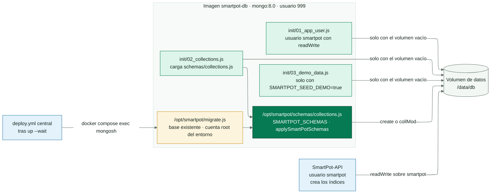
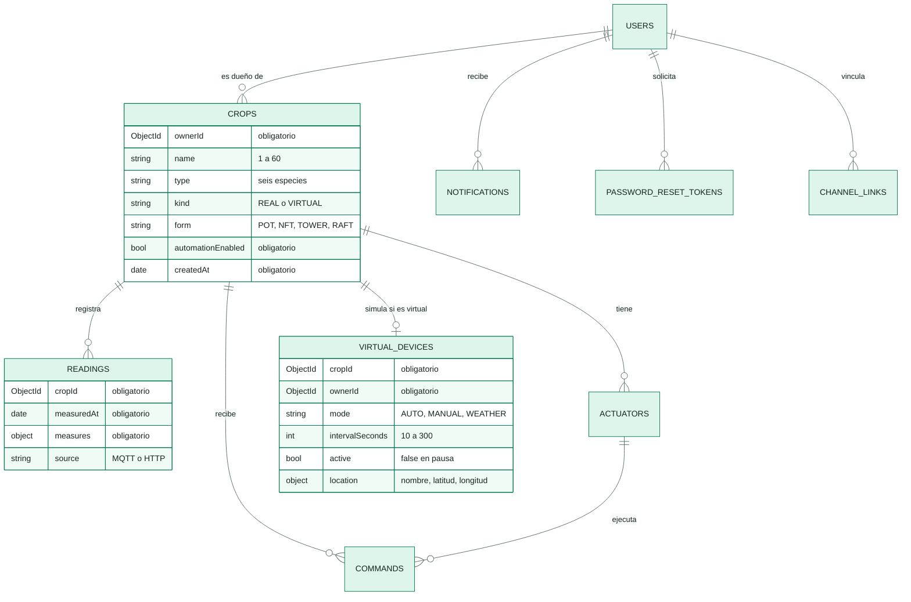
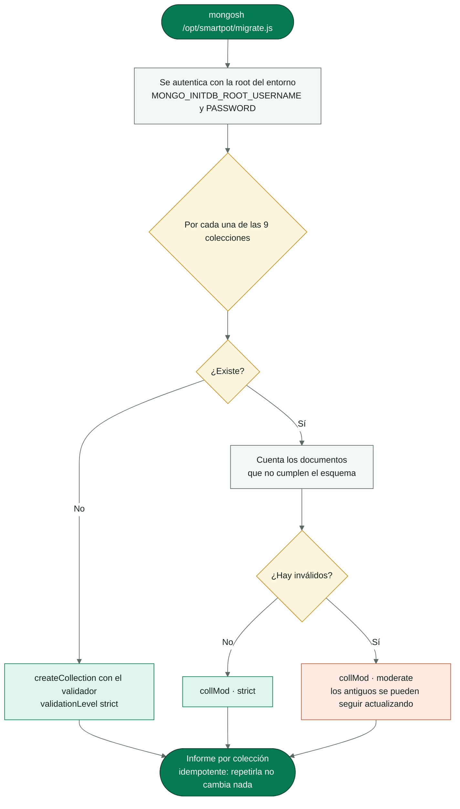

<!-- portada
eyebrow: Documentación del componente
titulo: SmartPot-DB
acento: DB
subtitulo: La memoria de SmartPot
bajada: MongoDB 8 con validación $jsonSchema en nueve colecciones, usuario de la aplicación con permisos mínimos, datos demo opcionales y migración idempotente para bases existentes.
documento: SmartPot-DB
version: 1.0 · septiembre 2026
equipo: SmartPotTech
proyecto: smartpot.app
-->

# SmartPot-DB

## Ficha del documento

| Campo                          | Valor                                                                                                                                                                                                                                                                                                                                                                                                                                                   |
|--------------------------------|---------------------------------------------------------------------------------------------------------------------------------------------------------------------------------------------------------------------------------------------------------------------------------------------------------------------------------------------------------------------------------------------------------------------------------------------------------|
| Proyecto                       | SmartPot · [smartpot.app](https://smartpot.app)                                                                                                                                                                                                                                                                                                                                                                                                         |
| Componente                     | [SmartPot-DB](https://github.com/SmartPotTech/SmartPot-DB)                                                                                                                                                                                                                                                                                                                                                                                              |
| Versión                        | 1.0 · septiembre 2026                                                                                                                                                                                                                                                                                                                                                                                                                                   |
| Alcance                        | Colecciones y validadores, inicialización, migración, datos demo, configuración, pruebas y operación                                                                                                                                                                                                                                                                                                                                                    |
| Documentación de la plataforma | [Documentación técnica](https://github.com/SmartPotTech/.github/blob/main/docs/SmartPot_Technical_Documentation.md), [recorrido del proyecto](https://github.com/SmartPotTech/.github/blob/main/docs/SmartPot_Project_Journey.md), [ciclo de vida](https://github.com/SmartPotTech/.github/blob/main/docs/SmartPot_Software_Lifecycle.md) y [diagramas generales](https://github.com/SmartPotTech/.github/blob/main/docs/README.md#diagramas-generales) |
| Mantenimiento                  | Se genera desde `docs/` de este repositorio con las herramientas de `.github/docs/tools`; se actualiza con cada cambio del componente                                                                                                                                                                                                                                                                                                                   |

<!-- parte: PARTE I | El componente -->

## 1. Propósito

### En palabras simples

La base guarda todo lo que SmartPot necesita recordar: las cuentas, los cultivos reales y virtuales con su forma, sus
lecturas, actuadores y órdenes, las notificaciones, los vínculos de Telegram y la configuración de las simulaciones.
Rechaza los documentos que no traen lo que la API necesita, y la API se conecta con un usuario que solo puede leer y
escribir su propia base.

## 2. Arquitectura del componente

<!-- diagrama: SmartPot_DB_Global_Component | titulo=SmartPot-DB por dentro | lamina=H -->

## 3. Colecciones

<!-- diagrama: SmartPot_DB_01_Collections | titulo=Colecciones y reglas principales -->

| Colección               | Campos obligatorios                                                               | Reglas                                                                          |
|-------------------------|-----------------------------------------------------------------------------------|---------------------------------------------------------------------------------|
| `users`                 | `email`, `passwordHash`, `role`, `createdAt`                                      | Hash BCrypt; rol `USER` o `ADMIN`                                               |
| `crops`                 | `ownerId`, `name`, `type`, `automationEnabled`, `createdAt`                       | Seis especies; `kind` `REAL` o `VIRTUAL`; `form` `POT`, `NFT`, `TOWER` o `RAFT` |
| `readings`              | `cropId`, `measuredAt`, `measures`                                                | Origen `MQTT` o `HTTP`; TTL de un año que crea la API                           |
| `actuators`             | `cropId`, `type`, `active`                                                        | Seis tipos                                                                      |
| `commands`              | `cropId`, `actuatorId`, `actuatorType`, `action`, `status`, `source`, `createdAt` | Estados y orígenes del catálogo; TTL de 180 días                                |
| `notifications`         | `userId`, `type`, `title`, `message`, `read`, `createdAt`                         | TTL de 90 días                                                                  |
| `password_reset_tokens` | `tokenHash`, `userId`, `expiresAt`                                                | Solo el SHA-256 del token                                                       |
| `channel_links`         | `userId`, `type`, `address`, `enabled`, `events`, `linkedAt`, `failures`          | Canal `TELEGRAM`                                                                |
| `virtual_devices`       | `cropId`, `ownerId`, `mode`, `intervalSeconds`, `createdAt`, `updatedAt`          | Solo cultivos virtuales; `active` en `false` durante la pausa                   |

<!-- parte: PARTE II | Operación -->

## 4. Migración

<!-- diagrama: SmartPot_DB_02_Migration_Flow | titulo=Migración de una base existente -->

Los scripts de `init/` solo corren con el volumen vacío. Una base existente recibe los esquemas nuevos con la migración,
que el despliegue central ejecuta después de `up --wait`; a mano:
`docker exec smartpot-db mongosh --quiet /opt/smartpot/migrate.js`.

## 5. Datos demo

Con `SMARTPOT_SEED_DEMO=true` se crea la cuenta `demo@smartpot.app` (contraseña pública de la demo) con dos cultivos *
*reales** que publica el simulador: lechugas en tubos NFT con modo automático y tomates cherry en maceta, cada uno con
48 horas de lecturas. Nunca se activa en producción.

## 6. Configuración

| Variable                                                           | Uso                                                   |
|--------------------------------------------------------------------|-------------------------------------------------------|
| `MONGO_INITDB_ROOT_USERNAME`, `MONGO_INITDB_ROOT_PASSWORD`         | Cuenta administradora, solo para inicializar y migrar |
| `SMARTPOT_DB_NAME`, `SMARTPOT_DB_USERNAME`, `SMARTPOT_DB_PASSWORD` | Base y usuario de la aplicación                       |
| `SMARTPOT_SEED_DEMO`                                               | Datos demo (`false` por defecto)                      |

## 7. Pruebas

`sh tests/validate.sh smartpot-db:ci true` levanta la imagen y comprueba las nueve colecciones con sus validadores, los
permisos del usuario de la aplicación, los datos demo y la migración sobre una base anterior (una colección sin
validador y otra con un documento antiguo), incluida su idempotencia. En Git Bash de Windows: `MSYS_NO_PATHCONV=1`.

## 8. Operación

| Tarea      | Cómo                                                                                                                         |
|------------|------------------------------------------------------------------------------------------------------------------------------|
| Imagen     | `ghcr.io/smartpottech/smartpot-db`: usuario `999`, solo lectura con `tmpfs` en `/tmp`                                        |
| Respaldo   | `mongodump` comprimido desde el servidor; restauración con `mongorestore --drop --archive --gzip`                            |
| Red        | Solo la red interna; nunca se publica el puerto 27017                                                                        |
| Despliegue | Cada cambio en `main` pasa por el CI, publica la imagen y pide el despliegue central de `.github`, que migra tras actualizar |
